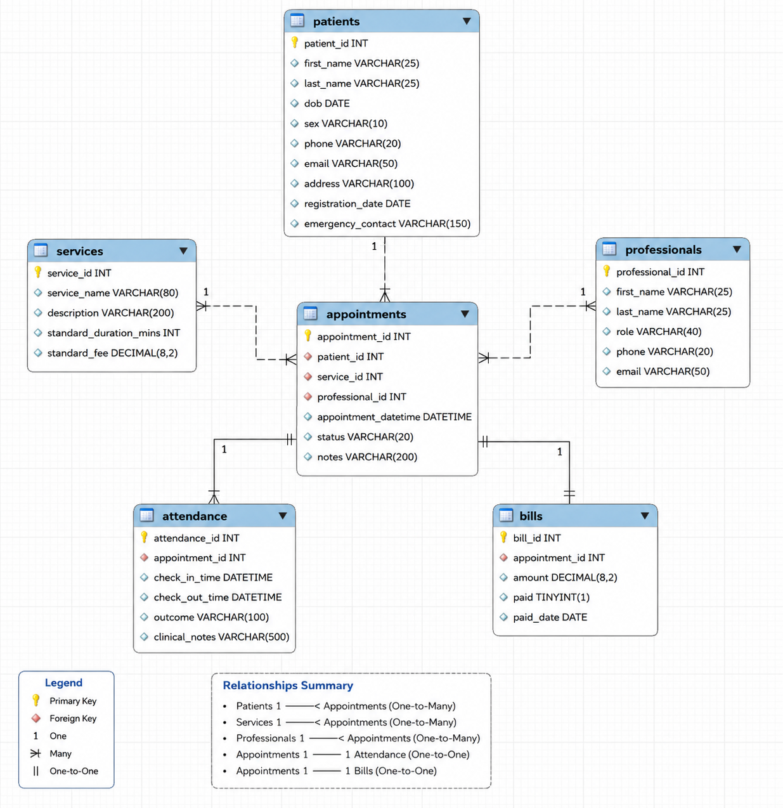

# Clinic Database System (SQL Project)

---

## Overview
This project presents the design and implementation of a relational database system for a healthcare clinic using SQL.

The system is developed to simulate real-world clinic operations by integrating multiple functional areas into a structured database. It enables efficient management of:
- Patient records and demographics  
- Appointment scheduling and tracking  
- Healthcare services and delivery  
- Clinical attendance and outcomes  
- Billing and payment processing  

The project demonstrates how relational databases can be used to organise complex operational data into a structured format that supports both day-to-day activities and analytical insights.

---

## Problem Statement
Healthcare clinics often operate with fragmented data systems, making it difficult to:
- Maintain consistent patient records  
- Track appointment activity and attendance  
- Monitor service usage and performance  
- Manage billing and payment status effectively  

This lack of integration can lead to inefficiencies, data inconsistencies, and limited visibility into clinic performance.

This project addresses these challenges by designing a **centralised relational database system** that connects all key operational components into a single, structured framework.

---

## Objectives
The key objectives of this project are:

- To design a robust relational database schema for healthcare operations  
- To establish clear relationships between entities using primary and foreign keys  
- To populate the database with realistic and non-repetitive sample data (100+ patients)  
- To simulate real-world appointment scenarios (completed, booked, cancelled, no-show)  
- To develop SQL queries that extract meaningful business insights  
- To demonstrate how structured data supports operational and analytical decision-making  

---

## Technologies Used
- **Database Management System:** MySQL  
- **Query Language:** SQL  

### Key Concepts Applied:
- Relational database design  
- Primary keys and foreign keys  
- Indexing for performance optimisation  
- JOIN operations (INNER JOIN)  
- Aggregation functions (SUM, COUNT)  
- Conditional logic using CASE statements  
- Data filtering and sorting  

---

## Database Design

### Entities
The database is structured around six core entities:

1. **Patients**  
   Stores demographic and contact information for each patient.

2. **Professionals**  
   Contains details of healthcare staff, including roles and contact details.

3. **Services**  
   Defines the services offered by the clinic, including duration and standard fees.

4. **Appointments**  
   Acts as the central entity, linking patients, professionals, and services.

5. **Attendance**  
   Tracks appointment outcomes, including attendance status and clinical notes.

6. **Bills**  
   Records billing information associated with each appointment.

---

### Relationships

- **Patients → Appointments**  
  One-to-many relationship where one patient can have multiple appointments.

- **Professionals → Appointments**  
  One-to-many relationship where one professional can handle multiple appointments.

- **Services → Appointments**  
  One-to-many relationship where each service can be used in multiple appointments.

- **Appointments → Attendance**  
  One-to-one relationship ensuring each appointment has a single attendance record.

- **Appointments → Bills**  
  One-to-one relationship ensuring each appointment has a corresponding billing record.

---

## ER Diagram

---

## 📁 Repository Structure

sql-clinic-database/
│── sql/
│ └── clinic_database.sql
│── er-diagram/
│ └── er_diagram.png
│── README.md
│── LICENSE

---

## Key Queries

### 1. Patient Demographics Analysis
Retrieves patients based on age range and gender to support targeted healthcare services.

---

### 2. Appointment Monitoring
Identifies cancelled and missed appointments to analyse operational inefficiencies.

---

### 3. Appointment Scheduling Insights
Extracts upcoming appointments with patient details to assist in planning and resource allocation.

---

### 4. Billing Status Analysis
Uses conditional logic to classify bills as *Paid* or *Unpaid*, enabling financial tracking.

---

### 5. Revenue Analysis by Service
Calculates total revenue generated by each service and identifies high-performing services.

---

### 6. Patient Engagement Analysis
Measures the number of visits per patient to understand utilisation patterns and engagement levels.

---

## Insights

- Certain services generate higher revenue despite lower usage frequency  
- Missed and cancelled appointments highlight potential inefficiencies in scheduling  
- Patient engagement varies significantly, indicating differences in healthcare needs  
- Billing data reveals potential delays in payment collection  

---

## Business Value

This database system provides significant value by enabling:

- Efficient management of patient and appointment records  
- Improved financial tracking and revenue analysis  
- Better allocation of healthcare resources  
- Enhanced visibility into clinic performance  
- Data-driven decision-making for operational improvements  

---

## Limitations

- The dataset is synthetic and does not represent real patient data  
- The system does not include real-time updates or automation  
- Limited scalability for multi-branch clinic environments  
- No integration with external healthcare or billing systems  

---

## Future Work

- Implement stored procedures and triggers for automation  
- Integrate dashboards using Tableau or Power BI  
- Extend schema to support multiple clinic locations  
- Add time-series analysis for appointment trends  
- Introduce user roles and access control  

---

## How to Run

1. Open MySQL Workbench (or any SQL environment)  
2. Create a new SQL query tab  
3. Open the file: `sql/clinic_database.sql`  
4. Execute the full script  
5. Run the example queries at the end of the script  

---

## Data Design

The dataset used in this project is synthetically generated to simulate realistic healthcare scenarios.

Key considerations:
- Non-repetitive and structured data  
- Consistent relationships across all tables  
- Balanced distribution of appointment statuses  
- Realistic variation in patient demographics and service usage  

---

## Author
  
**Gaurav Parashar**  
MSc Business Analytics  
Robert Gordon University
